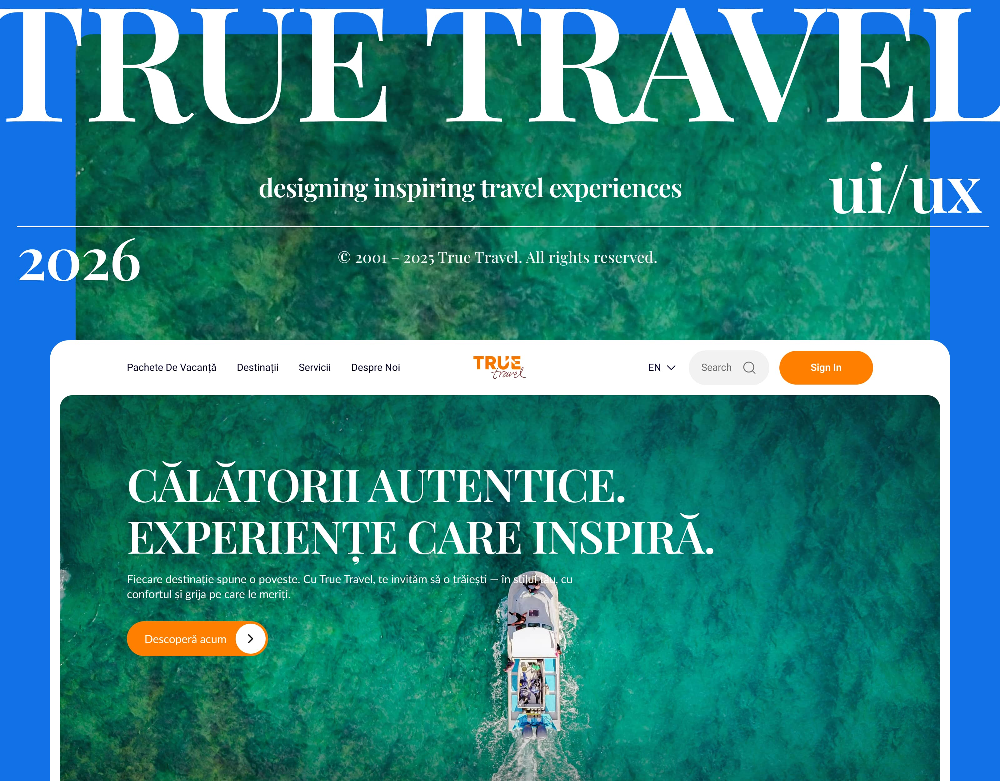
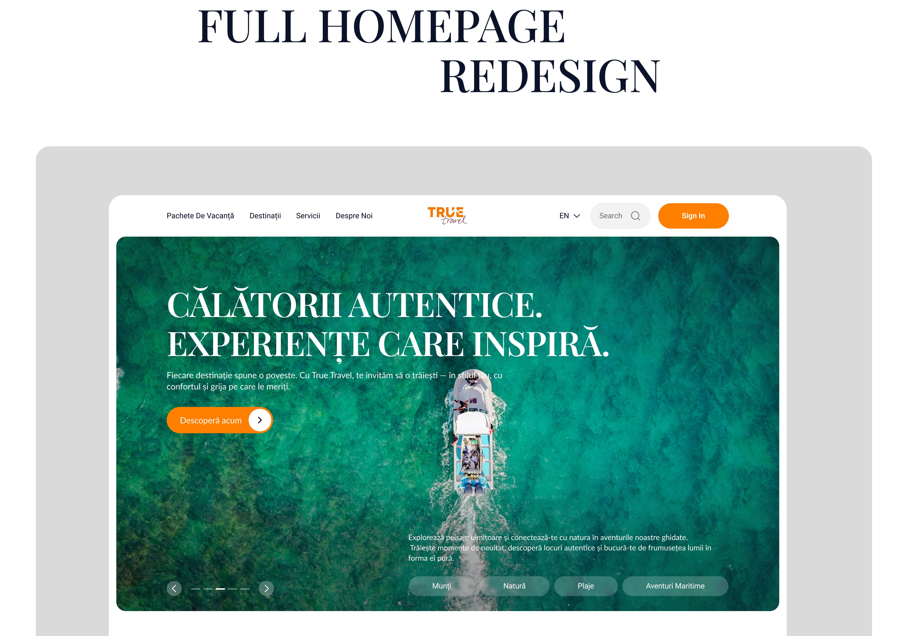
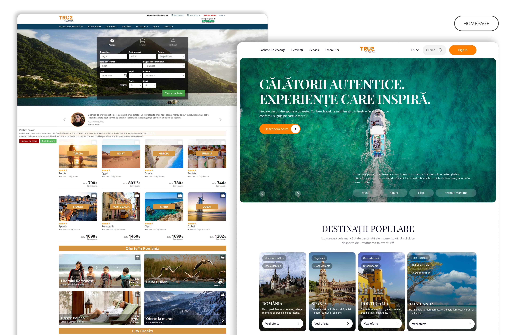
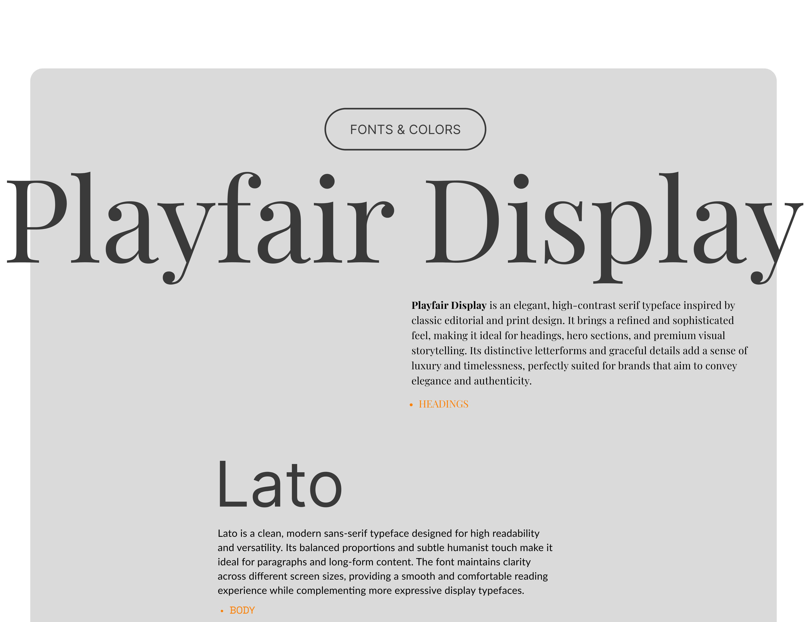
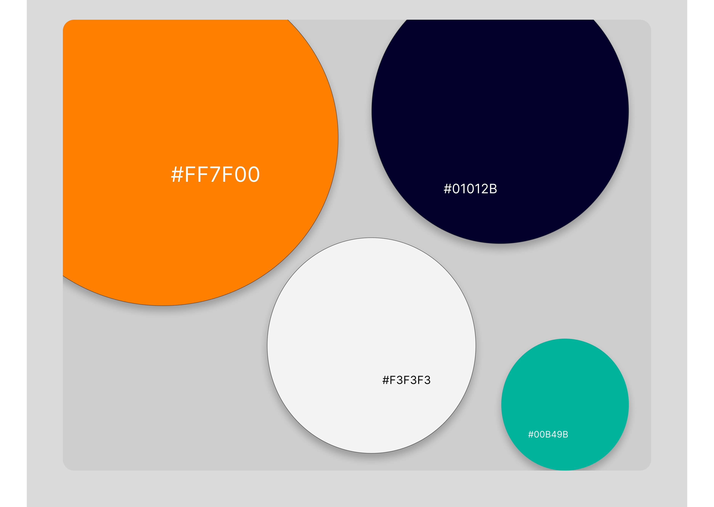
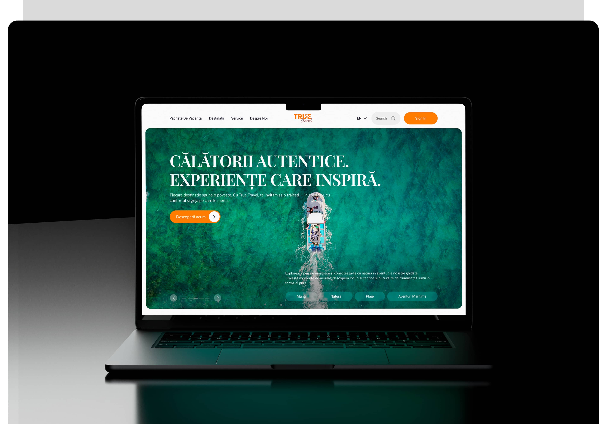

# Travel Agency Website UI/UX Redesign

Designed a modern travel agency website concept focused on improving navigation, user experience, and visual clarity. Created a cleaner and more engaging interface with stronger typography, better content organization, and conversion-focused sections to improve readability and user trust.

## Goals

- Improve visual hierarchy
- Create a cleaner browsing experience
- Increase usability and engagement
- Build a more modern visual direction
- Improve conversion-focused structure

## Tools

- Figma
- Webflow
- Photoshop

## Key Features

- Responsive layout
- Modern typography
- Structured travel sections
- Conversion-focused UI
- Mobile-friendly design

## Preview

### Cover Design

### Hero Section

### Before & After

### Typography System

### Color Palette

### Laptop View

